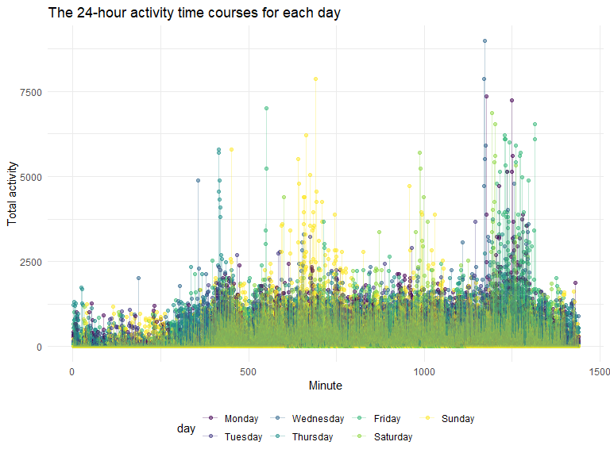
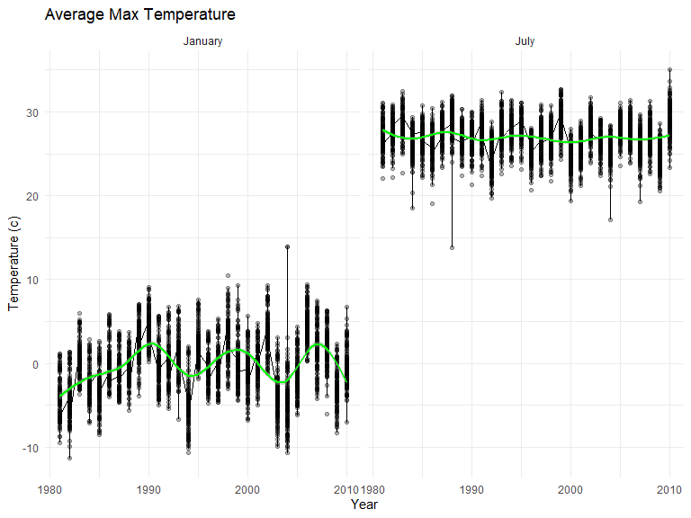
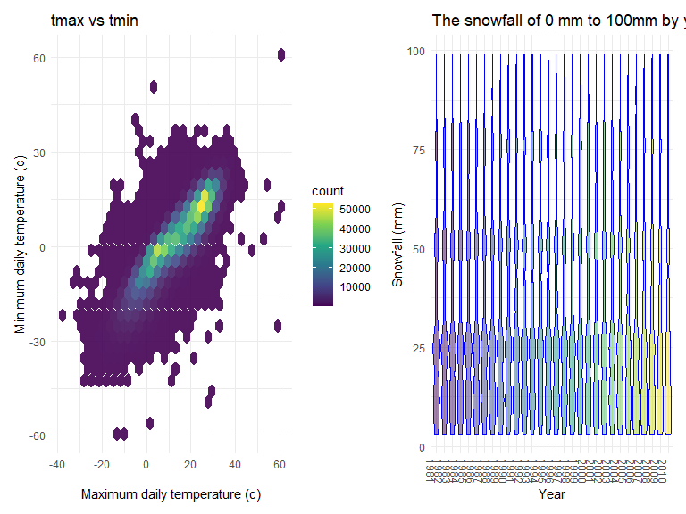

p8150_hw3_sy3019
================
Soungbin Yim
2022-10-14

### Due date

Due: October 15 at 11:59pm.

### Points

| Problem         | Points    |
|:----------------|:----------|
| Problem 0       | 20        |
| Problem 1       | –         |
| Problem 2       | 40        |
| Problem 3       | 40        |
| Optional survey | No points |

### Problem 0

This solution focuses on a reproducible report containing code and text
necessary for Problems 1-3, and is organized as an R Project. This was
not prepared as a GitHub repo; examples for repository structure and git
commits should be familiar from other elements of the course.

Throughout, we use appropriate text to describe our code and results,
and use clear styling to ensure code is readable.

### Problem 1

#### Read in the data

``` r
data("instacart")

instacart = 
  instacart %>% 
  as_tibble(instacart)

instacart
```

    ## # A tibble: 1,384,617 × 15
    ##    order_id product_id add_to_…¹ reord…² user_id eval_…³ order…⁴ order…⁵ order…⁶
    ##       <int>      <int>     <int>   <int>   <int> <chr>     <int>   <int>   <int>
    ##  1        1      49302         1       1  112108 train         4       4      10
    ##  2        1      11109         2       1  112108 train         4       4      10
    ##  3        1      10246         3       0  112108 train         4       4      10
    ##  4        1      49683         4       0  112108 train         4       4      10
    ##  5        1      43633         5       1  112108 train         4       4      10
    ##  6        1      13176         6       0  112108 train         4       4      10
    ##  7        1      47209         7       0  112108 train         4       4      10
    ##  8        1      22035         8       1  112108 train         4       4      10
    ##  9       36      39612         1       0   79431 train        23       6      18
    ## 10       36      19660         2       1   79431 train        23       6      18
    ## # … with 1,384,607 more rows, 6 more variables: days_since_prior_order <int>,
    ## #   product_name <chr>, aisle_id <int>, department_id <int>, aisle <chr>,
    ## #   department <chr>, and abbreviated variable names ¹​add_to_cart_order,
    ## #   ²​reordered, ³​eval_set, ⁴​order_number, ⁵​order_dow, ⁶​order_hour_of_day
    ## # ℹ Use `print(n = ...)` to see more rows, and `colnames()` to see all variable names

#### Answer questions about the data

This dataset contains 1384617 rows and 15 columns, with each row
resprenting a single product from an instacart order. Variables include
identifiers for user, order, and product; the order in which each
product was added to the cart. There are several order-level variables,
describing the day and time of the order, and number of days since prior
order. Then there are several item-specific variables, describing the
product name (e.g. Yogurt, Avocado), department (e.g. dairy and eggs,
produce), and aisle (e.g. yogurt, fresh fruits), and whether the item
has been ordered by this user in the past. In total, there are 39123
products found in 131209 orders from 131209 distinct users.

Below is a table summarizing the number of items ordered from aisle. In
total, there are 134 aisles, with fresh vegetables and fresh fruits
holding the most items ordered by far.

``` r
instacart %>% 
  count(aisle) %>% 
  arrange(desc(n))
```

    ## # A tibble: 134 × 2
    ##    aisle                              n
    ##    <chr>                          <int>
    ##  1 fresh vegetables              150609
    ##  2 fresh fruits                  150473
    ##  3 packaged vegetables fruits     78493
    ##  4 yogurt                         55240
    ##  5 packaged cheese                41699
    ##  6 water seltzer sparkling water  36617
    ##  7 milk                           32644
    ##  8 chips pretzels                 31269
    ##  9 soy lactosefree                26240
    ## 10 bread                          23635
    ## # … with 124 more rows
    ## # ℹ Use `print(n = ...)` to see more rows

Next is a plot that shows the number of items ordered in each aisle.
Here, aisles are ordered by ascending number of items.

``` r
instacart %>% 
  count(aisle) %>% 
  filter(n > 10000) %>% 
  mutate(aisle = fct_reorder(aisle, n)) %>% 
  ggplot(aes(x = aisle, y = n)) + 
  geom_point() + 
  labs(title = "Number of items ordered in each aisle") +
  theme(axis.text.x = element_text(angle = 60, hjust = 1))
```


Our next table shows the three most popular items in aisles
`baking ingredients`, `dog food care`, and `packaged vegetables fruits`,
and includes the number of times each item is ordered in your table.

``` r
instacart %>% 
  filter(aisle %in% c("baking ingredients", "dog food care", "packaged vegetables fruits")) %>%
  group_by(aisle) %>% 
  count(product_name) %>% 
  mutate(rank = min_rank(desc(n))) %>% 
  filter(rank < 4) %>% 
  arrange(desc(n)) %>%
  knitr::kable()
```

| aisle                      | product_name                                  |    n | rank |
|:---------------------------|:----------------------------------------------|-----:|-----:|
| packaged vegetables fruits | Organic Baby Spinach                          | 9784 |    1 |
| packaged vegetables fruits | Organic Raspberries                           | 5546 |    2 |
| packaged vegetables fruits | Organic Blueberries                           | 4966 |    3 |
| baking ingredients         | Light Brown Sugar                             |  499 |    1 |
| baking ingredients         | Pure Baking Soda                              |  387 |    2 |
| baking ingredients         | Cane Sugar                                    |  336 |    3 |
| dog food care              | Snack Sticks Chicken & Rice Recipe Dog Treats |   30 |    1 |
| dog food care              | Organix Chicken & Brown Rice Recipe           |   28 |    2 |
| dog food care              | Small Dog Biscuits                            |   26 |    3 |

Finally is a table showing the mean hour of the day at which Pink Lady
Apples and Coffee Ice Cream are ordered on each day of the week. This
table has been formatted in an untidy manner for human readers. Pink
Lady Apples are generally purchased slightly earlier in the day than
Coffee Ice Cream, with the exception of day 5.

``` r
instacart %>%
  filter(product_name %in% c("Pink Lady Apples", "Coffee Ice Cream")) %>%
  group_by(product_name, order_dow) %>%
  summarize(mean_hour = mean(order_hour_of_day)) %>%
  spread(key = order_dow, value = mean_hour) %>%
  knitr::kable(digits = 2)
```

    ## `summarise()` has grouped output by 'product_name'. You can override using the
    ## `.groups` argument.

| product_name     |     0 |     1 |     2 |     3 |     4 |     5 |     6 |
|:-----------------|------:|------:|------:|------:|------:|------:|------:|
| Coffee Ice Cream | 13.77 | 14.32 | 15.38 | 15.32 | 15.22 | 12.26 | 13.83 |
| Pink Lady Apples | 13.44 | 11.36 | 11.70 | 14.25 | 11.55 | 12.78 | 11.94 |

### Problem 2

#### load, tidy, and wrangle the data

``` r
accel_df = read_csv("./accel_data.csv") %>%
  janitor::clean_names() %>%
  pivot_longer(
    activity_1:activity_1440,
    names_to = "minute",
    names_prefix = "activity_",
    values_to = "activity",
  ) %>%
  mutate(
    day = factor(day, levels = c("Monday", "Tuesday", "Wednesday", "Thursday", "Friday","Saturday", "Sunday"), ordered = TRUE), 
    weekday_weekend = case_when(
      day %in% c("Monday", "Tuesday", "Wednesday", "Thursday", "Friday") ~ "weekday",
      day %in% c("Saturday", "Sunday" ~ "weekdend") ~ "weekend"),
    weekday_weekend = as_factor(weekday_weekend),
    minute = as.numeric(minute)
  )
```

    ## Rows: 35 Columns: 1443
    ## ── Column specification ────────────────────────────────────────────────────────
    ## Delimiter: ","
    ## chr    (1): day
    ## dbl (1442): week, day_id, activity.1, activity.2, activity.3, activity.4, ac...
    ## 
    ## ℹ Use `spec()` to retrieve the full column specification for this data.
    ## ℹ Specify the column types or set `show_col_types = FALSE` to quiet this message.

For the data set, there are `week`, `day_id`, `day`, `minute`,
`activity`, and `weekday_weekend` variables. There are 50400
observations and 6 columns in this dataset.

#### A total activity variable for each day

``` r
accel_df %>%
  group_by(week, day) %>%
  summarize(total_act = sum(activity)) %>%
  pivot_wider(
    names_from = "day",
    values_from = "total_act"
  ) %>%
  knitr::kable(digits = 2)
```

    ## `summarise()` has grouped output by 'week'. You can override using the
    ## `.groups` argument.

| week |    Monday |  Tuesday | Wednesday | Thursday |   Friday | Saturday | Sunday |
|-----:|----------:|---------:|----------:|---------:|---------:|---------:|-------:|
|    1 |  78828.07 | 307094.2 |    340115 | 355923.6 | 480542.6 |   376254 | 631105 |
|    2 | 295431.00 | 423245.0 |    440962 | 474048.0 | 568839.0 |   607175 | 422018 |
|    3 | 685910.00 | 381507.0 |    468869 | 371230.0 | 467420.0 |   382928 | 467052 |
|    4 | 409450.00 | 319568.0 |    434460 | 340291.0 | 154049.0 |     1440 | 260617 |
|    5 | 389080.00 | 367824.0 |    445366 | 549658.0 | 620860.0 |     1440 | 138421 |

There is no apparant trend except the `Sunday` activity generally
decreased as the week progressed, and `Wednesday` had consistant
activity throughout 5 weeks. Week 4 and Week 5 value of the `Saturday`
had value of 1440, which is total number of minute per day and probably
data entry mistakes.

#### Creating single-panel plot

``` r
accel_df %>%
  group_by(minute, week, day) %>%
  summarize(total_act = sum(activity)) %>%
    ggplot(aes(x = minute, y = total_act, color = day)) + 
   labs(
    title = "The 24-hour activity time courses for each day ",
    x = "Minute",
    y = "Total activity"
  ) +
    geom_point(alpha = 0.5) + geom_line(alpha = 0.3) +
    theme(legend.position = "bottom")
```

    ## `summarise()` has grouped output by 'minute', 'week'. You can override using
    ## the `.groups` argument.



Based on the graph, most of the activity is below 2500. On Sunday, most
peak of activities are around at 11 am. for the weekdays, there are
peaks of activities at around 7 am or 8-9 pm. There seems to be more
activities on Friday.

### Problem 3

#### Loading, tidying and wrangling the data

``` r
library(p8105.datasets)
data("ny_noaa")
tidy_noaa = ny_noaa %>%
  janitor::clean_names() %>%
  dplyr::mutate(year = lubridate::year(date), 
                month = lubridate::month(date), 
                day = lubridate::day(date)) %>%
  mutate(tmax = as.numeric(tmax), 
         tmin = as.numeric(tmin),
         tmax = tmax/10, tmin = tmin/10,
         snow = ifelse(snow == -13, NA, snow),
         )
```

``` r
table(tidy_noaa$snow)

tidy_noaa %>%
  group_by(snow) %>%
  summarize(n = n()) %>%
  arrange(desc(n))
```

The most observed value for snowfall was 0 with 2008508 observation, and
out of the entire year and location, most of them do not experience
snow, so it makes sense to have value of 0 as most observed value. There
was a value of -13 for snow, which does not make sense, so I deleted it.

#### A two-panel plot showing the average max temperature in January and in July in each station

``` r
tidy_noaa %>%
  filter(month == c("1", "7")) %>%
  group_by(id, year, month) %>%
  summarize(mean_tmax = mean(tmax, na.rm = TRUE)) %>%
  ggplot(aes(x = year, y = mean_tmax), group = id) + 
    geom_line() + geom_point(alpha = 0.3) + 
    geom_smooth(aes(x = year, y = mean_tmax), color = "green", show.legend = FALSE) +
    facet_grid(~month, labeller = labeller(month = c("1" = "January", "7" = "July"))) +
   labs(
    title = "Average Max Temperature",
    x = "Year",
    y = "Temperature (c)"
  )
```

    ## `summarise()` has grouped output by 'id', 'year'. You can override using the
    ## `.groups` argument.
    ## `geom_smooth()` using method = 'gam' and formula 'y ~ s(x, bs = "cs")'



``` r
  theme(legend.position = "none")
```

    ## List of 1
    ##  $ legend.position: chr "none"
    ##  - attr(*, "class")= chr [1:2] "theme" "gg"
    ##  - attr(*, "complete")= logi FALSE
    ##  - attr(*, "validate")= logi TRUE

January has lower average temperature, and more fluctuating temperature
compared to July. There are some noticeable outliers at around year 2004
for January, and at around year 1988 for July.

#### (i) tmax vs tmin for the full dataset (note that a scatterplot may not be the best option)

``` r
tmax_tmin = 
  tidy_noaa %>%
  ggplot(aes(x = tmax, y = tmin), color = id) +
  geom_hex(alpha = 0.9) +
  theme(legend.position = "right") +
  labs(
    title = "tmax vs tmin",
    x = "Maximum daily temperature (c)",
    y = "Minimum daily temperature (c)"
  )
```

#### (ii) make a plot showing the distribution of snowfall values greater than 0 and less than 100 separately by year

``` r
snow100 = 
  tidy_noaa %>%
  filter(
    snow > 0, 
    snow < 100) %>%
  mutate(year = as.factor(year)) %>%
  ggplot(aes(x = year, y = snow)) +
  geom_violin(aes(fill = year), color = "blue", alpha = .5) +
  theme(legend.position = "none") +
  labs(
    title = "The snowfall of 0 mm to 100mm by year",
    x = "Year",
    y = "Snowfall (mm)"
  ) +
     theme(axis.text.x = element_text(angle = 270))
```

#### two-panel plot combining both plots

``` r
tmax_tmin + snow100 
```



``` r
ggsave("tmax_tmin + snow100.pdf", width = 10, height = 5)
```
